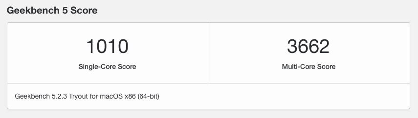

# Acer Nitro 5 AN515-54-51X1


# Supports Catalina 10.15.7, Big Sur 11.4


#### System configuration

| Model     | AN515-54 51X1                                      |
| :-------- | :------------------------------------------------- |
| Processor | Intel® Core™ i5-9300H                              |
| Graphics  | Intel® UHD Graphics 630 & Nvidia GeForce® GTX 1050 |
| Ram       | 16GB DDR4-2666Mhz                                  |
| Disk      | SK Hynix 256gb PCIe® NVMe™                         |
| Audio     | Realtek HD Audio ALC255                            |
| Wifi      | Intel(R) Wireless-AC 9560 160MHz                   |
| Ethernet  | RealTek RTL8168/8111 PCI-E Gigabit Ethernet        |


# About build

#### Performance

<p align="center">
  
</p>

- [Geekbench 5](https://browser.geekbench.com/v5/cpu/3285570)

#### What Working

- [x] Audio, Input/Mic, Output
- [x] iGPU
- [x] Fully Functional QE/CI Enabled Graphics
- [x] ACPI Display brightness
- [x] Ethernet
- [x] Sleep + Wake
- [x] Smart Touchpad + Gestures
- [x] WiFi (2.4Ghz and 5GHz) [Airportitlwm](https://github.com/OpenIntelWireless/itlwm)
- [x] Native hotkey support with Fn keys
- [x] FaceTime, Messages, Icloud

#### Not Working

- [ ] HDMI due to Nvidia Optimus
- [ ] Nvidia GeForce® GTX 1050

# Installation

- Create a Bootable USB using Olarila images, [guide](https://www.olarila.com/topic/5794-hackintosh-guide-install-macos-with-vanilla-olarila-image-step-by-step-install-and-post-install-windows-linux-or-mac/) here

### Note
Please use Xcode or ProperTree for customize config file

(Don't use OpenCore Configuration, Clover Configuration or it will **BROKE** your config file)

### BIOS Settings

| BIOS config | Settings |
| :---------- | :------- |
| SATA        | AHCI     |
| Secure Boot | Disable  |

### BIOS Unlock (Advanced User)

> This is for disable CFG-Lock and edit DVMT [Guide](https://github.com/Hoang63X/AN515-54-51X1-Hackintosh/blob/master/BIOS/README.md) here

| Name                          | Address  | Configable value | Default value |
| :---------------------------- | :------- | :--------------- | :------------ |
| CFC-Lock                      | 0x3E     | 0x0 (Disable)    | 0x1           |

### Post Installation
- Sleep Wake

```shell
sudo pmset -a hibernatemode 0
sudo pmset -a autopoweroff 0
sudo pmset -a standby 0
sudo pmset -a proximitywake 0
```
- > `-b` - Battery `-c` - AC Power `-a` - Both

# Credits

- [acidanthera](https://github.com/acidanthera) for almost all kexts and drivers
- [dortania](https://dortania.github.io/OpenCore-Install-Guide/) for OC guide
- [Olarila](https://www.olarila.com) for the iso images
- [Hackintosh-stuff](https://github.com/hackintosh-stuff/ComboJack) for the ComboJack
- [Daliansky](https://github.com/daliansky/) for the [OC](https://github.com/daliansky/OC-little/) hotpatch guide [黑果小兵的部落阁](https://blog.daliansky.net/)
